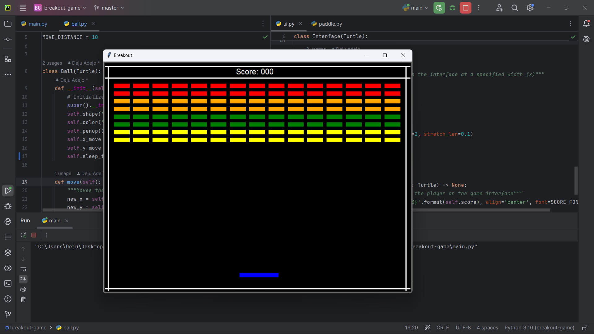

# 1976 Breakout Game
This repository features an implementation of the classic 1976 Breakout game, developed using Python and the Turtle graphics library.

The implementation is centered on demonstrating my competency with Object-Oriented Programming.

# Features
* ***Classic Gameplay:*** Faithful recreation of the original Breakout game, with paddles, bricks, and ball mechanics. (Single Player mode though)
* ***Enhanced Graphics:*** Smooth and colorful graphics using the Turtle library to create a visually appealing interface.
* ***Score Tracking:*** Real-time score updates and tracking, with visual representation on the game interface.
* ***Dynamic Difficulty:***
  - Ball speed increases with every fourth (4th) and twelfth (12th) hit
  - Ball speed increases with every third hit (contact) with an orange or red brick
  - The paddle movement speed increases after every third hit with the orange or red bricks
  - The paddle size shrinks when the ball breaks through to the top wall of the interface
* ***Customizable Interface:*** Easily configurable interface with different brick layouts and colors that can be passed as a dictionary for varied gameplay experiences.
* ***User-Friendly Controls:*** Intuitive controls for easy and responsive paddle movement.

# Installation
If you are interested in checking the game, you can install this way:

* Clone the repository:
  ```bash
  git clone https://github.com/DejusDevspace/breakout-game.git
  ```

* Navigate to the project directory:
  ```bash
  cd breakout-game
  ```

  # Usage
* Run the game:
  ```bash
  python main.py
  ```
* Controls
  - Use the left and right arrow keys to move the paddle.
  - Break all the bricks to advance to the next level.

# Acknowledgements
* Inspired by the original Breakout game developed by Atari in 1976.
* Developed using the Python [Turtle Graphics](https://docs.python.org/3/library/turtle.html) library.

# Screenshots
 
 
